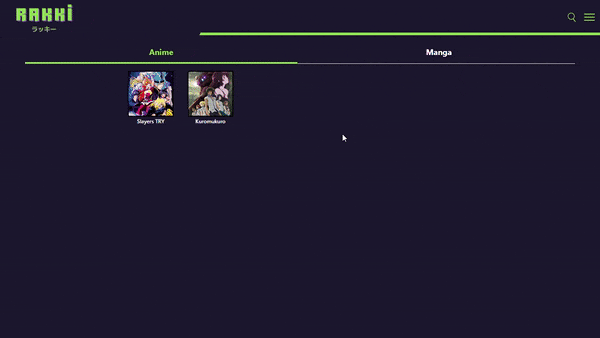
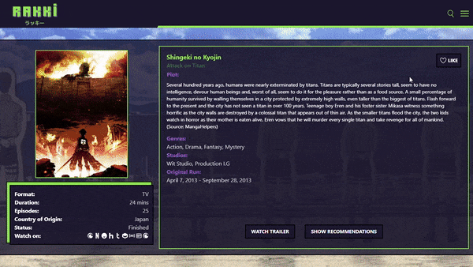

# Rakki - A Random Anime/Manga Generator

<div align="center">

</div>

## Introduction
This app was created as a personal project. It was made using [ReactJS](reactjs.org) and [TailwindCSS](tailwindcss.com) as CSS framework.
<div align=center>

<picture>
  <source media="(prefers-color-scheme: dark)" srcset="./public/img/tailwindcss-logotype-white.svg">
  
</picture>
</div>
All data is fetched from [Anilist](anilist.co)'s public API (Application Programming Interface). The API uses the [GraphQL](graphql.org) query language to handle requests as opposed to REST APIs.

 You can learn more about the public API in the [documentation](https://anilist.gitbook.io/anilist-apiv2-docs/) provided or use their [Interactive GraphQL Editor](https://anilist.co/graphiql).

I made this choice of API because the documentation made things easy to understand and to better familiarize myself with GraphQL queries.

# How to run
The app was created using [Create React App](https://create-react-app.dev/). You can learn more in the documentation.

You can install dependencies by using Node Package Manager NPM. 

Make sure you have Node installed in your system type the following commands:

```console
$ git clone https://github.com/youssefjj/rakki.git # Clone repository

$ cd rakki # Change working directory

$ npm install # Install dependencies

$ npm start # Run the React app
``` 

# Features
As mentioned previously, Rakki gets all of it's data from the Anilist API, and I've added the ability to select a random anime or manga on the fly. 

The reason that, from my experience , it's always bothersome for me to look for an anime to watch, or select one from my backlog and even that process takes a lot of time 😅. 

So I've made Rakki 😊, a simple application with a simple interface, and some easter eggs sprinkled here and there 😉.
## Randomize Anime/Manga
 Choose a random media (anime or manga) and display major info such as main plot, genres, number of episodes/chapters, tailer, etc... 

May Lady Luck shine on you 🍀!


## Media Recommendations 
If you like a media title (anime or manga) you can display other shows or manga like it (according to recommendations submitted by users in Anilist).


## Favourite Media
Add to/Remove from favourites: You can have up to 50 favourites in either media type (anime or manga)



## Search Anime or Manga
Search Anime/Manga by name



# Missing Features
The app still has a some missing features such as:
- Search filters
- Custom Random Media Generation; choose random media by genre or number of episodes/chapters, etc...
- Increase maximum number of favourites (currently 50 for each type of media)
- Favourites filtering/sorting
- etc...
# Contributions
Pull requests are welcome. For major changes, please open an issue first to discuss what you would like to change.

# License
This project uses the [MIT](https://choosealicense.com/licenses/mit/) license